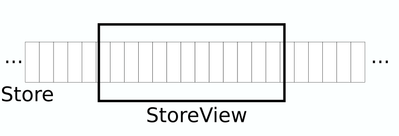

# View

Our view will have a three parts.

1. Task widget
2. Tasks list
3. Main window

I've decided to split the view this way so each part of implementation is easier to understand. Making it smallest amount of lines of code was not a goal here.

## Task

In previous section we've created a store which holds the list of tasks. Now we need the ability to show the task.

Task should have a `checkbox` to be marked when completed. Label to show task description. If task is completed label should be styled with `strikethrough`.

In here we will implement `store::FactoryBuilder` to provide a view for items in the store. You would use `FactoryBuilder` trait in all the places where using pure `relm4` you would use `relm4::factory::FactoryPrototype`.

Differences between the `relm4::factory::FactoryPrototype` and `store::FactoryBuilder`

|What|FactoryPrototype | FactoryBuilder |
|:---|:----------------|:---------------|
| **Target of implementation** | You implement it for the ViewModel. | You implement it for whatever you like. This makes this interface behave more like configuration. |
| **Data container** | `type Factory` which points to data container in the ViewModel | `type Store` which points to data container outside of ViewModel. |
| **Data visibility** | All data in the factory are visible. | Only part of data in the Store is visible. `type Window` defines how the view window behaves (more in chapter 2 and 3). |
| Method signature | Since you implemented the factory for the ViewModel, it takes `self` as an argument. You create a widgets to display `self`. Second is key under which factory is going to find it. Key is unstable and managed by the factory. | It's not bound to `self`. First is record for which widgets should be created. Second is position in the store. Position in the dataset at the time of widget generation. There is no guarantee to get the same widget in the future when asking store for record at the given position. Record is required to hold stable id by implementing `model::Identifialble`. |

Let's create a file `view/task.rs`

```rust
use reexport::{gtk, relm4};
use gtk::{Box, CheckButton, Label, Orientation, 
    prelude::{BoxExt, CheckButtonExt}};
use relm4::{send, Sender};
use model::{Id, Identifiable};
use store::{FactoryBuilder, Position, math::PositionTrackingWindow};
use crate::model::Task;
use crate::store::Tasks;

pub enum TaskMsg {
    Toggle{
        complete: bool,
        id: Id<Task>,
    },
    New,
}

#[derive(Debug)]
#[allow(dead_code)]
pub struct TaskWidgets {
    checkbox: CheckButton,
    label: Label,
    root: Box,
}

pub struct TaskFactoryBuilder {}

impl FactoryBuilder for TaskFactoryBuilder {
    type Store = Tasks;
    type Widgets = TaskWidgets;
    type Root = gtk::Box;
    type View = gtk::Box;
    type Window = PositionTrackingWindow;
    type Msg = TaskMsg;

    fn generate(
        record: &Task,
        _position: Position,
        sender: Sender<TaskMsg>,
    ) -> Self::Widgets {
        let root = Box::builder()
            .orientation(Orientation::Horizontal)
            .build();

        let checkbox = CheckButton::builder()
            .margin_top(12)
            .margin_start(12)
            .margin_end(12)
            .margin_bottom(12)
            .active(record.completed)
            .build();

        {
            let sender = sender.clone();
            let id = record.get_id();

            checkbox.connect_toggled(move |btn| {
                send!(sender, TaskMsg::Toggle{
                    id,
                    complete: btn.is_active()
                });
            });
        }

        let label = Label::builder()
            .margin_top(12)
            .margin_start(12)
            .margin_end(12)
            .margin_bottom(12)
            .label(&record.description)
            .build();

        root.append(&checkbox);
        root.append(&label);

        TaskWidgets {
            checkbox,
            label,
            root,
        }
    }

    fn update(
        record: Task,
        _position: Position,
        widgets: &Self::Widgets,
    ) {
        widgets.checkbox.set_active(record.completed);

        let attrs = widgets.label.attributes().unwrap_or_default();
        attrs.change(gtk::pango::Attribute::new_strikethrough(record.completed));
        widgets.label.set_attributes(Some(&attrs));
    }

    fn position(
        _model: Task, 
        _position: Position,
    ) {}

    fn get_root(widgets: &Self::Widgets) -> &Self::Root {
        &widgets.root
    }
}
```

Let's look at the first part of `FactoryBuilder` implementation

```rust
    type Store = Tasks;
    type Widgets = TaskWidgets;
    type Root = gtk::Box;
    type View = gtk::Box;
    type Window = PositionTrackingWindow;
    type Msg = TaskMsg;
```

| type name | value | meaning |
|:----------|:------|:--------|
| Store     | crate::store::Tasks | This type provides information about which store type will be used. This itself also provides information abut the model which (`DataStoreBase::Model`) which is used by the related store and as the consequence this view. In relm4's `FactoryPrototype` you would provide factory type instead. |
| Widgets | crate::view::TaskWidgets | The same as in relm4's `FactoryPrototype::Widgets`. Type of structure holding all widgets. |
| Root    | gtk::Box | Type of widgets which is a root for all widgets kept in the `Self::Widgets`. Same as in `FactoryPrototype::Root`. |
| View    | gtk::Box | Type of widgets which will keep the list of widgets. (The widget to which factory should add widgets to). Same as in `FactoryPrototype::View`. There must exist implementations of `relm4::factory::FactoryView` and `relm4::factory::FactoryListView` for `View`. |
| Window  | PositionTrackingWindow | Describes how the view window will behave in case of new data. Exactly what this does will be discussed in chapter 2. For now use `PositionTrackingWindow` with annotation that if you don't know what to use, this one is probably the one. |
| Msg | TaskMsg | The same as in `FactoryPrototype::Msg`. Type of messages accepted by the view. |

Next we implemented `generate`, `update`, `position` and `get_root` methods. They do exactly the same stuff as in `relm4::factory::FactoryPrototype` so I'll skip talking about it.

## Task list

We know how to show a task. Now let's talk how to show the list of tasks. We will implement it as the relm4 component.

view/task_list.rs

```rust
use reexport::{gtk, relm4, relm4_macros};
use std::{cell::RefCell, rc::Rc};
use gtk::prelude::{BoxExt, EntryExt, EntryBufferExtManual, OrientableExt, WidgetExt};
use relm4::{ComponentUpdate, Model as ViewModel, send, Sender, Widgets, WidgetPlus};
use relm4_macros::widget;
use store::{DataStoreBase, Source, StoreViewInterface};
use crate::{ model::Task, store::Tasks, view::task::{TaskFactoryBuilder, TaskMsg}};

type StoreMsg = store::StoreMsg<Task>;

pub trait TasksListConfiguration: Source<SV=StoreViewInterface<TaskFactoryBuilder>> {
    fn get_tasks(parent: &Self::ParentViewModel) -> Rc<RefCell<Tasks>>;
}

pub struct TasksListViewModel<Config> 
where Config: TasksListConfiguration,
{
    view: Config::SV,
    tasks: Rc<RefCell<Tasks>>,
    new_task_description: gtk::EntryBuffer,
}

impl<Config> ViewModel for TasksListViewModel<Config>
where Config: TasksListConfiguration,
{
    type Msg = TaskMsg;
    type Widgets = TasksListViewWidgets;
    type Components = ();
}

impl<Config> ComponentUpdate<Config::ParentViewModel> for TasksListViewModel<Config>
where Config: TasksListConfiguration,
{
    fn init_model(parent_model: &Config::ParentViewModel) -> TasksListViewModel<Config> {
        TasksListViewModel{
            view: Config::store(parent_model),
            tasks: Config::get_tasks(parent_model),
            new_task_description: gtk::EntryBuffer::new(None),
        }
    }

    fn update(
        &mut self,
        msg: TaskMsg,
        _components: &(),
        _sender: Sender<TaskMsg>,
        _parent_sender: Sender<<Config::ParentViewModel as ViewModel>::Msg>
    ) {
        match msg {
            TaskMsg::New => {
                let description = self.new_task_description.text();
                let task = Task::new(description, false);
                self.new_task_description.set_text("");
                self.tasks.borrow().inbox(StoreMsg::New(task));
            },
            TaskMsg::Toggle{ complete, id } => {
                let tasks = self.tasks.borrow();
                if let Some((_, record)) = tasks.get(&id) {
                    let mut updated = record.clone();
                    updated.completed = complete;
                    tasks.inbox(StoreMsg::Commit(updated));
                }
            },
        }
    }
}

#[widget(visibility=pub, relm4 = relm4)]
impl<Config> Widgets<TasksListViewModel<Config>, Config::ParentViewModel> for TasksListViewWidgets
where Config: TasksListConfiguration,
{
    view!{
        root = &gtk::Box {
            set_margin_all: 12,
            set_orientation: gtk::Orientation::Vertical,
            append: input = &gtk::Entry::with_buffer(&model.new_task_description) {
                connect_activate => move |_| {
                    send!(sender, TaskMsg::New)
                },  
            },
            append = &gtk::ScrolledWindow {
                set_child = Some(&gtk::Box) {
                    set_orientation: gtk::Orientation::Vertical,
                    factory!(model.view),
                },
                set_hexpand: true,
                set_vexpand: true,
            }
        }
    }
}
```

Now we will talk about interesting bits in the implementation.

View model definition looks like

```rust
pub trait TasksListConfiguration: Source<SV=StoreViewInterface<TaskFactoryBuilder>> {
    fn get_tasks(parent: &Self::ParentViewModel) -> Rc<RefCell<Tasks>>;
}

pub struct TasksListViewModel<Config> 
where Config: TasksListConfiguration,
{
    view: Config::SV,
    tasks: Rc<RefCell<Tasks>>,
    new_task_description: gtk::EntryBuffer,
}
```

Task list view model is parametrized with configuration implementing `TasksListConfiguration + Source`. This goes along reusable components pattern in relm4.

The view model contains three attributes

| Attribute | Description |
|:----------|:------------|
| view      | It's a store view. It's responsible for tracking the state of the store and provide the information back to the view via factory. |
| tasks     | It's a store which we defined in previous chapter |
| new_task_description | It's a buffer used by `gtk::Entry` which contains the description of a new task |

The reference `tasks` allows us to access all tasks which are defined in the application. `view` allows the ui to show content of the store.



View implements `relm4::factory::Factory` and `relm4::factory::FactoryPrototype` already for you so you don't need to care about propagation of changes between store and the view.

There only one line of code which is interesting there

```rust
    factory!(model.view),
```

As you see `StoreView` is kind of the factory.

Rest is classic relm4.

## Main window

view/main_window.rs

```rust
use reexport::{gtk, relm4, relm4_macros};
use std::{ cell::RefCell, rc::Rc};
use gtk::prelude::GtkWindowExt;
use relm4::{AppUpdate, Components, Model as ViewModel, Sender, RelmComponent, Widgets};
use relm4_macros::widget;
use store::{Source, StoreSize, StoreViewInterface};

use crate::{
    store::Tasks,
    view::{ task::TaskFactoryBuilder, task_list::TasksListConfiguration, task_list::TasksListViewModel}
};

pub enum MainWindowMsg {}

pub struct MainWindowViewModel {
    pub tasks: Rc<RefCell<Tasks>>
}

impl ViewModel for MainWindowViewModel {
    type Msg = MainWindowMsg;
    type Widgets = MainWindowWidgets;
    type Components = MainWindowComponents;
}

impl AppUpdate for MainWindowViewModel {
    fn update(
        &mut self, 
        _msg: Self::Msg , 
        _components: &Self::Components, 
        _sender: Sender<Self::Msg>
    ) -> bool {
        true
    }
}

pub struct MainWindowComponents {
    tasks_list: RelmComponent<TasksListViewModel<Self>, MainWindowViewModel>
}

impl Components<MainWindowViewModel> for MainWindowComponents {
    fn init_components(
        parent_model: &MainWindowViewModel,
        parent_widgets: &MainWindowWidgets,
        parent_sender: Sender<MainWindowMsg>,
    ) -> Self {
        Self {
            tasks_list: RelmComponent::new(parent_model, parent_widgets, parent_sender.clone()),
        }
    }
}

impl Source for MainWindowComponents {
    type ParentViewModel = MainWindowViewModel;
    type SV = StoreViewInterface<TaskFactoryBuilder>;

    fn store(parent_model: &Self::ParentViewModel) -> Self::SV {
        StoreViewInterface::new(parent_model.tasks.clone(), 10)
    }
}

impl TasksListConfiguration for MainWindowComponents {
    fn get_tasks(parent_model: &Self::ParentViewModel) -> Rc<RefCell<Tasks>> {
        parent_model.tasks.clone()
    }
}

#[widget(visibility=pub, relm4=relm4)]
impl Widgets<MainWindowViewModel, ()> for MainWindowWidgets {
    view!{
        root = gtk::ApplicationWindow {
            set_child: component!(Some(components.tasks_list.root_widget()))
        }
    }
}
```

Only interesting part is implementation of `Source` for MainWindowComponents.

```rust
impl Source for MainWindowComponents {
    type ParentViewModel = MainWindowViewModel;
    type SV = StoreViewInterface<TaskFactoryBuilder>;

    fn store(parent_model: &Self::ParentViewModel) -> Self::SV {
        StoreViewInterface::new(parent_model.tasks.clone(), StoreSize::Unlimited)
    }
}
```

This is required so we know how to build concrete view. Important think to note is value `StoreSize::Unlimited` placed as the argument of the method `StoreViewInterface::new`. It describes how many elements from store should be visible. In this case view will always show all elements in the store. For small stores it's fine. The moment your store grows bigger it will be a huge performance issue. In chapter 2 we will show how to implement pagination to make view for big stores behave fast.

[Let's wrap it up](./04-main.md)
