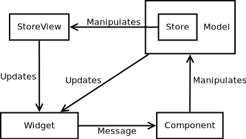

# Application architecture

When you write your application in `relm4` you use classic MVC pattern. `relm4-store` introduces some "proxies" into the picture.

In `relm4` terms it looks like this


View sends events to component in reaction to user input and component updates the model witch in turn modifies view. `relm4::Model` combines two roles housekeeping of data in the app and controller of app and view. This two roles are not mixed up thanks to Rust language itself. `relm4::ComponentUpdate` interface implementation is the controller part and structure implementing `relm4::Model` is doing the application model part.

When you use this library then this changes into



## How does it fit into my relm4 application

`relm4-store` tries it's best to be an extension to `relm4::Model` part of an application.

### Data store

Store is part of the relm4's model. Inside of the store you would keep data which should be persisted. For example

```text
You are developing a drawing application. In it user can place shapes and draw lines between shapes. When user adds a shape to the drawing area you append it to the list of shapes. If user draws an arrow you append it to the list of arrows. At any point of time user can select one of the elements on the diagram be it arrow or a shape and change it's color.

Using relm4-store you would create two stores, one for shapes and one for arrows. Whenever user draws one of the shapes you would add them to appropriate store. Selection of the diagram element would be kept directly in `relm4::Model`. State of the color changing window (wherever it's open or not) would also be directly in the `relm4::Model`. The color change action
would on the other hand be sent to one of the stores to handle the update event of one of the records.

Saving a file now would require to read the content of the both stores and writing it down to the file.
```

### Store view

Store view is also part of the relm4's model. It represents current state of the user interface. In case of drawing application example

```text
You are developing a drawing application. In it user can place shapes and draw lines between shapes. When user adds a shape to the drawing area you append it to the list of shapes. If user draws an arrow you append it to the list of arrows. At any point of time user can select one of the elements on the diagram be it arrow or a shape and change it's color.

Using relm4-store you would create two views (one for each store) for every drawing area showing the diagram

- Drawing area - 2 store views
- Minimap - 2 store views
- Split view - 2 store views
- ...

You would use a store view to tell you which shapes to draw. So if you add new shape or an arrow then only affected part of the ui would be updated. 
```

### Database analogy

Other way of thinking about store is to look at it as database table. The store view in such a case is result of the `SELECT` statement on the store.
